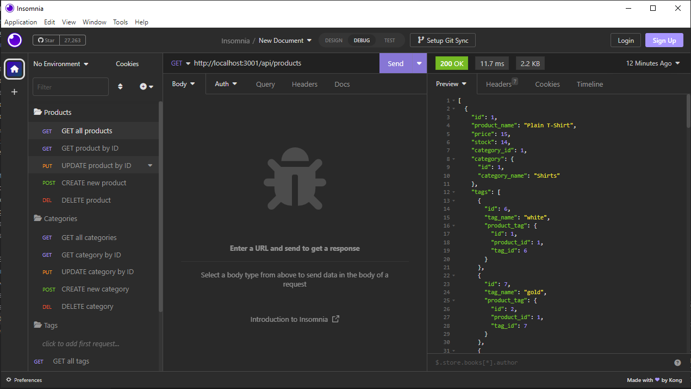
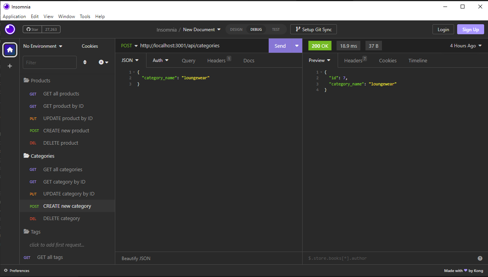
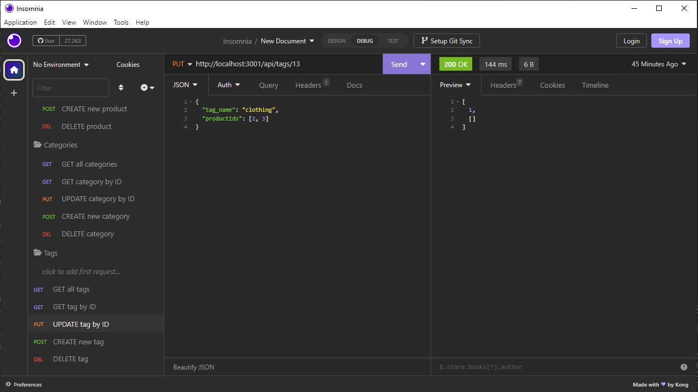

# ecommerce_back_end
Back-end build for an e-commerce site using Express.js, Sequelize, and MySQL.

## User Story
AS A manager at an internet retail company  
I WANT a back end for my e-commerce website that uses the latest technologies  
SO THAT my company can compete with other e-commerce companies

## Acceptance Criteria
GIVEN a functional Express.js API  
WHEN I add my database name, MySQL username, and MySQL password to an environment variable file  
THEN I am able to connect to a database using Sequelize  
WHEN I enter schema and seed commands  
THEN a development database is created and is seeded with test data  
WHEN I enter the command to invoke the application  
THEN my server is started and the Sequelize models are synced to the MySQL database  
WHEN I open API GET routes in Insomnia Core for categories, products, or tags  
THEN the data for each of these routes is displayed in a formatted JSON  
WHEN I test API POST, PUT, and DELETE routes in Insomnia Core  
THEN I am able to successfully create, update, and delete data in my database

## Description of Work Performed
* Used MySQL2 and Sequelize packages to connect to a MySQL database
* Used dotenv package to store sensitive environment variable data
* Sequelize models are synced to MySQL database on server start
* Created models for categories, products, and tags
  * Created index.js file to define associations between models
  * Created a ProductTag model to maintain relative associations between products and tags
* Created API routes for categories, products, and tags to perform the following actions:
  * Get all
  * Get by ID
  * Update
  * Create new
  * Delete

## Link to walkthrough tutorial
[Ecommerce Back End Walkthrough](https://drive.google.com/file/d/1oL7FJKKAtSJpAQNngMovbuLVswyyQ23E/view?usp=sharing)

## Screenshots

## License
This project is licensed under the MIT License - see the LICENSE.md file for details.

# NPM Packages Utilized
- [Sequelize](https://www.npmjs.com/package/sequelize)
- [Dotenv](https://www.npmjs.com/package/dotenv)
- [MySQL2](https://www.npmjs.com/package/mysql)